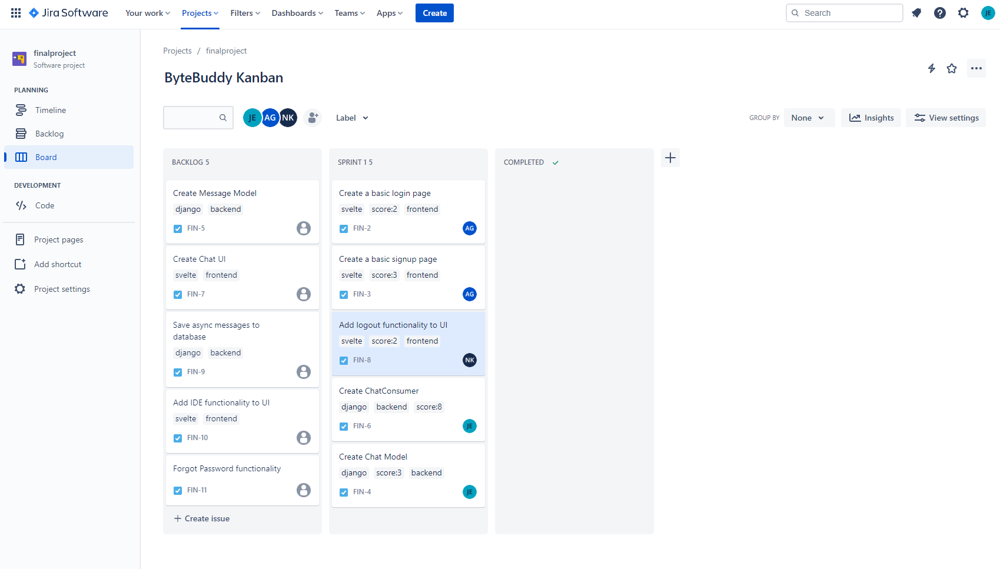

# Sprints
Our sprints are planned using Jira. On Jira, we have a kanban board with cards placed in backlog, sprint, and completed columns. [Link to the Jira kanban board.](https://greead04-acs560.atlassian.net/jira/software/projects/FIN/boards/1)

Selecting a card on the kanban board will show details of the task, completion criteria, assignments, labels, and the given effort score.

Effort scores are selected using Fibonacci scoring (1, 2, 3, 5, and 8) with 1 being the lowest required effort and 8 being the highest required effort.

Below are screenshots of the kanban board for each of our sprints. The latest sprints are shown at the top.

## Sprint 1
